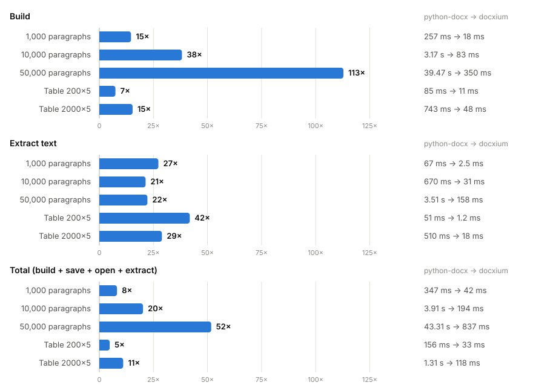
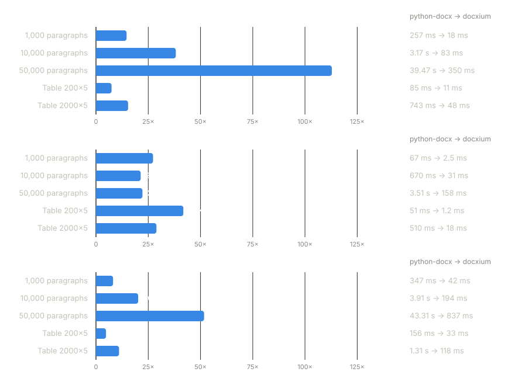

Benchmarks
==========

Method
------

Each workload is run with python-docx and with docxium, on one thread. The value reported is the
median of 7 rounds.

* **Workloads.** Paragraphs of three runs each (one plain, one bold, one italic), and tables of
  five columns.
* **build.** Creates the document from in-memory data. The time includes preparing that data.
* **extract.** Reads the text of all paragraphs.
* **save**, **open.** Writes the document to a file and parses it again.
* **total.** build + save + open + extract.

Speed-up
--------

Speed-up is the python-docx time divided by the docxium time.

Save and open are performed by python-docx in both columns; their ratios lie between
0.93× and 1.05×.

Measurements
------------

.. list-table::
   :header-rows: 1

   * - Workload
     - Phase
     - python-docx
     - docxium
     - Speed-up
   * - 1,000 paragraphs
     - build
     - 257 ms
     - 18 ms
     - 14.7×
   * - 1,000 paragraphs
     - extract
     - 67 ms
     - 2.5 ms
     - 27.3×
   * - 1,000 paragraphs
     - save
     - 12 ms
     - 12 ms
     - 1.0×
   * - 1,000 paragraphs
     - open
     - 11 ms
     - 10 ms
     - 1.0×
   * - 1,000 paragraphs
     - total
     - 347 ms
     - 42 ms
     - 8.2×
   * - 10,000 paragraphs
     - build
     - 3.17 s
     - 83 ms
     - 38.2×
   * - 10,000 paragraphs
     - extract
     - 670 ms
     - 31 ms
     - 21.4×
   * - 10,000 paragraphs
     - save
     - 39 ms
     - 38 ms
     - 1.0×
   * - 10,000 paragraphs
     - open
     - 39 ms
     - 42 ms
     - 0.9×
   * - 10,000 paragraphs
     - total
     - 3.91 s
     - 194 ms
     - 20.2×
   * - 50,000 paragraphs
     - build
     - 39.47 s
     - 350 ms
     - 112.8×
   * - 50,000 paragraphs
     - extract
     - 3.51 s
     - 158 ms
     - 22.2×
   * - 50,000 paragraphs
     - save
     - 155 ms
     - 151 ms
     - 1.0×
   * - 50,000 paragraphs
     - open
     - 174 ms
     - 179 ms
     - 1.0×
   * - 50,000 paragraphs
     - total
     - 43.31 s
     - 837 ms
     - 51.7×
   * - Table 200×5
     - build
     - 85 ms
     - 11 ms
     - 7.5×
   * - Table 200×5
     - extract
     - 51 ms
     - 1.2 ms
     - 41.8×
   * - Table 200×5
     - save
     - 11 ms
     - 11 ms
     - 0.9×
   * - Table 200×5
     - open
     - 9.1 ms
     - 8.7 ms
     - 1.0×
   * - Table 200×5
     - total
     - 156 ms
     - 33 ms
     - 4.8×
   * - Table 2000×5
     - build
     - 743 ms
     - 48 ms
     - 15.4×
   * - Table 2000×5
     - extract
     - 510 ms
     - 18 ms
     - 28.9×
   * - Table 2000×5
     - save
     - 27 ms
     - 26 ms
     - 1.0×
   * - Table 2000×5
     - open
     - 26 ms
     - 26 ms
     - 1.0×
   * - Table 2000×5
     - total
     - 1.31 s
     - 118 ms
     - 11.0×
